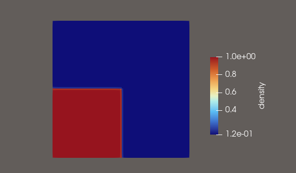

# euler (riemann) solver for compressible flow


hi, this project was made to self learn cfd

i took inspiration from cfd.university for some of the code

copy it as you like


## Governing Equations

The Euler equations describe the conservation of mass, momentum, and energy for inviscid compressible flows. In one dimension, these can be written as ∂U/∂t + ∂F(U)/∂x = 0, where U represents the vector of conserved variables [ρ, ρu, E]ᵀ. The system is closed through the ideal gas equation of state p = (γ - 1)(E - ½ρu²), where γ = 1.4 for air. The two-dimensional extension includes an additional momentum component ρv and corresponding fluxes in both coordinate directions.

## Numerical Methods


we use a FVM on a uniform Cartesian grid. 3 reconstruction schemes are used -

The piecewise constant reconstruction is the simplest first-order approach, equivalent to Godunov's method. The MUSCL - Monotonic Upstream-centered Scheme for Conservation Laws scheme provides second-order accuracy through linear reconstruction within each cell. To maintain monotonicity and prevent spurious oscillations near discontinuities, flux limiters are incorporated that automatically reduce to first-order accuracy in regions of large gradients. Three limiters are implemented: MinMod (most dissipative but stable), van Leer (smoother with good monotonicity), and van Albada (smooth variation between upwind and central differencing).

The WENO5 (Weighted Essentially Non-Oscillatory) scheme is the most sophisticated reconstruction method, offering fifth-order accuracy in smooth regions. It uses a convex combination of three polynomial reconstructions on different stencils, with weights dynamically adjusted based on smoothness indicators. Near discontinuities, the weights automatically favor the smoothest stencil, effectively avoiding oscillations while maintaining high accuracy in smooth regions.

### Riemann Solver

At each cell interface, the reconstruction produces left and right states that differ, creating a local Riemann problem. This implementation employs the Rusanov flux (Local Lax-Friedrichs flux), an approximate Riemann solver that provides a simple yet robust approach. The interface flux is computed as F_{i+1/2} = ½[F(U_L) + F(U_R)] - ½S_max(U_R - U_L), where S_max represents the maximum wave speed. While more dissipative than upwind schemes like Roe or HLLC, the Rusanov flux guarantees positivity of density and pressure under appropriate CFL conditions.


Time advancement uses the forward Euler method,  is constrained by the  Courant-Friedrichs-Lewy condition to ensure stability: Δt = C(Δx/S_max). In two dimensions, the condition uses Δt = C·min(Δx, Δy)/S_max.

### Boundary conditions

The solvers implement extrapolation boundary conditions at all domain boundaries. For the 1D  Sod shock problem, density and energy are extrapolated. The two-dimensional solver uses pure extrapolation at all four boundaries, copying values from the first interior cell to the ghost cells.

## Implementation

The one-dimensional solver `euler.cpp` provides a testbed for various reconstruction schemes and serves as the foundation for the two-dimensional implementation. It solves the classic Sod shock tube problem and outputs CSV files at each time step containing position, density, velocity, and pressure. Users can easily switch between reconstruction schemes and flux limiters by modifying enumeration variables at the beginning of the main function.

The two-dimensional solver `euler2d.cpp` extends the formulation using dimensional splitting, where fluxes in each coordinate direction are computed independently. The conservative variable vector includes four components. MUSCL reconstruction is performed separately in x and y directions, with face values computed at all four faces (WEST, EAST, SOUTH, NORTH) of each cell. The solver outputs VTK format files every 10 time steps for visualization in ParaView.

## paraview

The two-dimensional solver outputs vtkt files that can be opened directly in ParaView.



visualization of the 2d shock problem in paraview

## run

Both solvers are written in C++17 and can be compiled using g++ or CMake. For direct compilation:

```bash
g++ -std=c++17 -O2 euler.cpp -o euler
g++ -std=c++17 -O2 euler2d.cpp -o euler2d
```

Or using CMake:

```bash
mkdir build && cd build && cmake .. && make
```


## References

Toro, E. F. (2009). Riemann Solvers and Numerical Methods for Fluid Dynamics: A Practical Introduction

LeVeque, R. J. (2002). Finite Volume Methods for Hyperbolic Problems

van Leer, B. (1979). Towards the ultimate conservative difference scheme. V. A second-order sequel to Godunov's method. *Journal of Computational Physics*, 32(1), 101-136.

